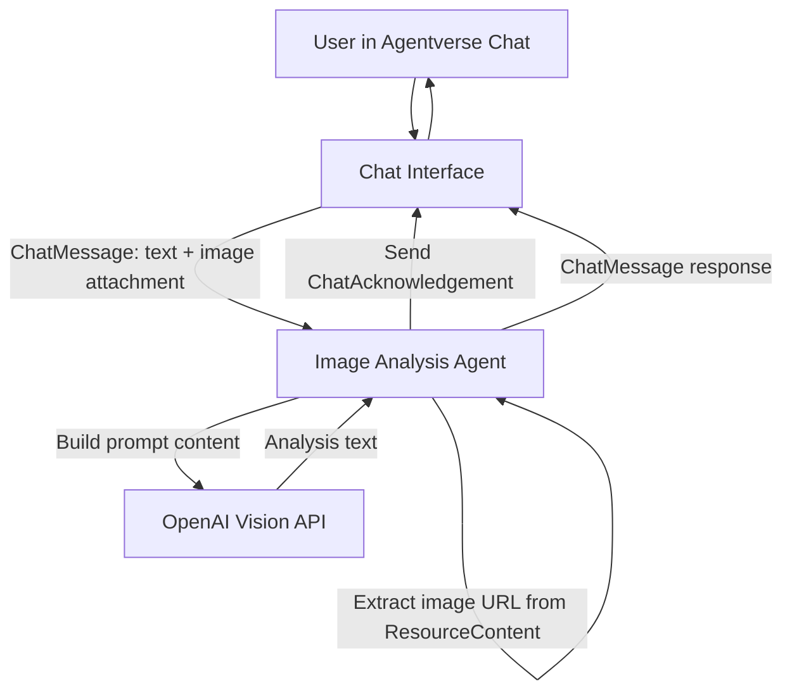

# Image Analysis Agent (OpenAI + ASI1)

This project is a lightweight image-analysis uAgent for Agentverse chat.

It accepts:
- user text prompts
- image attachments from chat

And returns:
- a natural-language image analysis generated with OpenAI Vision

## Key Features

- Chat protocol compatible (`ChatMessage` + `ChatAcknowledgement`)
- Attachment support announced on session start
- Direct image URL handling from chat payloads (no storage download dependency)
- Detailed logs for incoming and outgoing messages
- OpenAI-only inference flow (no Anthropic)

## Project Files

- `agent.py` - chat handlers, URL extraction, logging, and response flow
- `image_analysis.py` - OpenAI Vision request builder and response parser
- `requirements.txt` - runtime dependencies

## Workflow



## Environment Variables

Required:
- `OPENAI_API_KEY`

Optional:
- `MAX_TOKENS` (default: `1024`)
- `IMAGE_MODEL_ENGINE` (default: `gpt-4.1-mini`)

## Setup

```bash
cd /Users/engineer/image-ana
python3 -m venv .venv
source .venv/bin/activate
pip install -r requirements.txt
```

## Run

```bash
export OPENAI_API_KEY="your-openai-key"
python3.10 agent.py
```

## Agentverse Hosted Agent Setup

1. Create a hosted agent on Agentverse.
2. Upload:
   - `agent.py`
   - `image_analysis.py`
3. Enable Agent Chat Protocol for the agent.
4. Add a short, searchable description in the Agent Overview.

## Troubleshooting

- `OPENAI_API_KEY is required`
  - set env var before running the agent
- `Attachment URL not found`
  - re-upload image from chat UI and resend query
- empty or generic analysis
  - use a clearer question, or switch to a stronger model in `IMAGE_MODEL_ENGINE`
